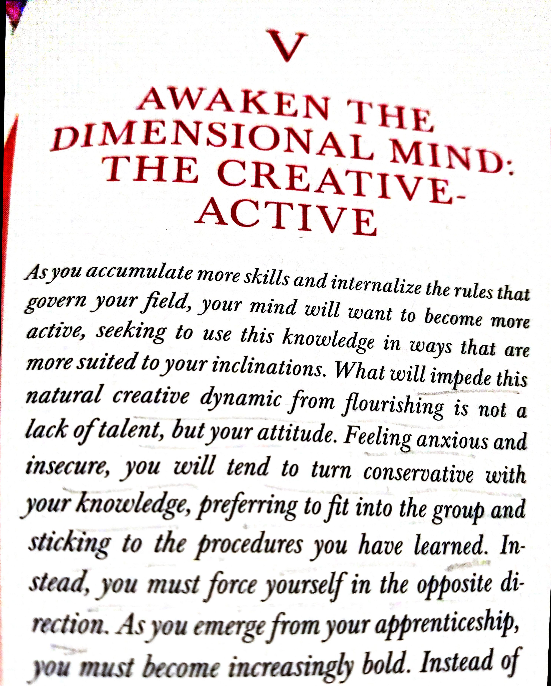
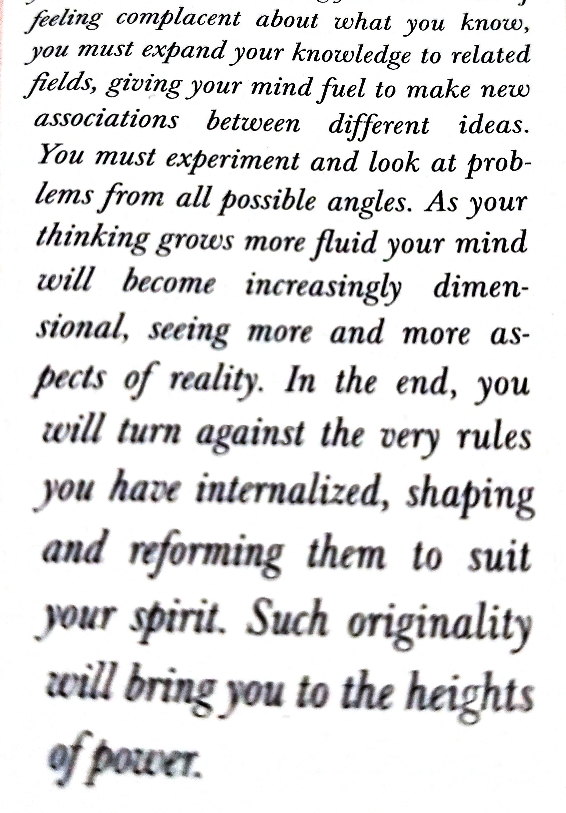
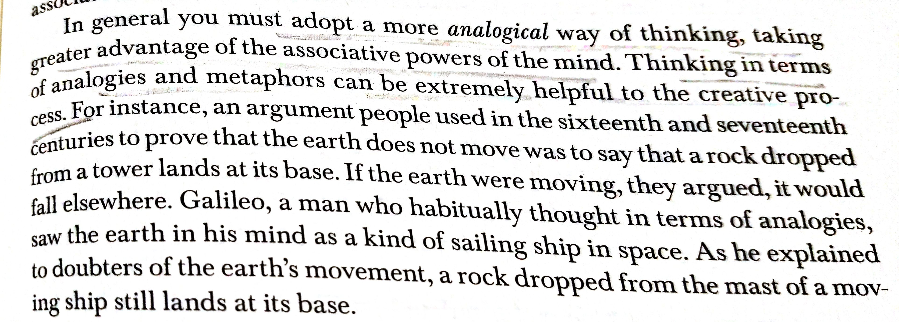

# Awaken the Dimensional Mind: The Create-Active
---

Masters and those who display a high level of create energy are simply people who manage to retain a sizable portion of their childhood spirit despite the pressures and demands of adulthood. This spirit manifests itself in their work and in their ways of thinking. Children are naturally creative. They actively transform everything around them, play with ideas and circumstances, and surprise us with the novel things they say or do. But the natural creativity of children is limited; it never leads to discoveries, inventions, or substantial works of art.

**Dimensional Mind** - discipline and a childlike spirit. Such a mind is not constricted by limited experience or habits. It can branch out into all directions and make deep contact with reality, It can explore more dimensions of the world. The Conventional Mind is passive- it consumes information and regurgitates it in familiar forms. The *Dimensional Mind* is active, transforming everything it digests into something new and original, *creating* instead of *consuming*.

Understand: we all possess an inborn creative force that wants to become active. This is the gift of out *Original Mind*, which reveals such potential. The human mind is naturally creative, constantly looking to make associations and connections between things and ideas. It wants to explore, to discover new aspects of the world, and to invent. To express this creative force is our greatest desire, and the stifling of it the source of our misery. What kills the creative force is not age or a lack of talent, but our own spirit, our own attitude. We become too comfortable with the knowledge we have gained in our apprenticeships. We grow afraid of entertaining new ideas and the effort that this required. To think more flexibly entails a risk- we could fail and be ridiculed. We prefer to live with familiar ideas and habits of thinking, but we pay a steep price for this; our minds fo dead from the lack of challenge and novelty; we reach a limit in our field and lose control over our date because we become replaceable.

The Dimensional Mind had two essential requirements:

- a high level of knowledge about a field or subject
- the openness and flexibility to use this knowledge in new and original ways.

Awaken the Dimensional mind through three steps:

## Step One: The Creative Task

The *Primary Law of the Creative Dynamic* is that you must engrave deeply in your mind and never forget: your emotional commitment to what you are doing will be translated directly into your work.

To aid in this process, it is often wise ti choose something that appeals to your sense of unconventionality and calls up latent feelings of rebelliousness.

Two things to keep in mind:

- The task that you choose must be realistic. Also, it is always best to choose a task that is slightly above you, one that might be considered ambitious on your part.

- You must let go of your need for comfort and security. Think of yourself as an explorer. You cannot find anything new if you are unwilling to leave the shore.

## Step Two: Creative Strategies

Think if the mind as a muscle that naturally tightens up over time unless it is consciously worked upon. The only antidote is to enact strategies to loosen up the mind and let in alternative ways of thinking.

**Cultivate Negative Capability**

We are by nature fearful and insecure creatures. We don not like what is unfamiliar of unknown. To compensate for this, we assert ourselves with opinions and ideas that make us seem string and certain. Many if these opinions do not come from our own deep reflection, but are instead based on what other people think. Furthermore, once we hold these ideas, to admit they are wrong is to wound our ego and vanity. Truly creative people in all fields can temporarily suspend their ego and simple experience what they are seeing, without the need to assert a judgement, for as long as possible, They are more than ready to find their most cherished opinions contradicted by reality. This ability to endure and even embrace mysteries and uncertainties is called as Negative Capability.

**Allow for Serendipity**

Let go of conscious control and allowing chance to enter into the process. Serendipity - The occurrence of something we are not expecting= and although by their nature you cannot force them to happen, you can invite serendipity into the creative process by taking two simple steps.

The first step is to widen your search as far as possible. In the research stage of your project, you look at more than what is generally required. You expand your search into other fields, reading and absorbing any related information. If you have a particular theory or hypothesis about a phenomenon, you examine as many examples and potential counterexamples as humanly possible. It might seem tiring and inefficient, but you must trust this process. What ensues is that the brain becomes increasingly excited and stimulated by the variety of information.

The second step is to maintain an openness and looseness of spirit, In moments of great tension and searching, you allow yourself moments of release. You take walks, engage in activities outside your work. When some new and unanticipated idea now enters your mind, you do not ignore it because it irrational or does not fit the narrow frame of your previous work. You five it instead full attention and explore where it leads you.

> Chance favors only the prepared mind.

To help yourself to cultivate serendipity, you should keep a notebook with you all the times (Or notes app).The moment any idea or observation comes, you note it down.

**Alternate the mind through "The Current"**

You have an idea for a new product. You can design it on your own and then launch it, but often you notice a discrepancy between your own level of excitement for your product and the somewhat indifferent response of the public. You have not engaged in a dialogue with reality, which is the essence of the *Current*. Instead, it is better to product a prototype-a form of speculation and see how people respond to it. Based on the assessments you fain, you can redo the work and launch it again, cycling through this process several times until you perfect it. The responses of the public will make you think more deeply about what you are producing. Such feedback will help make visible what is generally invisible to your eyes- the objective reality of your work and its flaws as reflected though the eyes of many people. Alternating between ideas and artifact will help you to create something compelling and effective.

**Alter your perspective**

// TO DO..

**Revert to primal forms of intelligence**

// TO DO.

----
