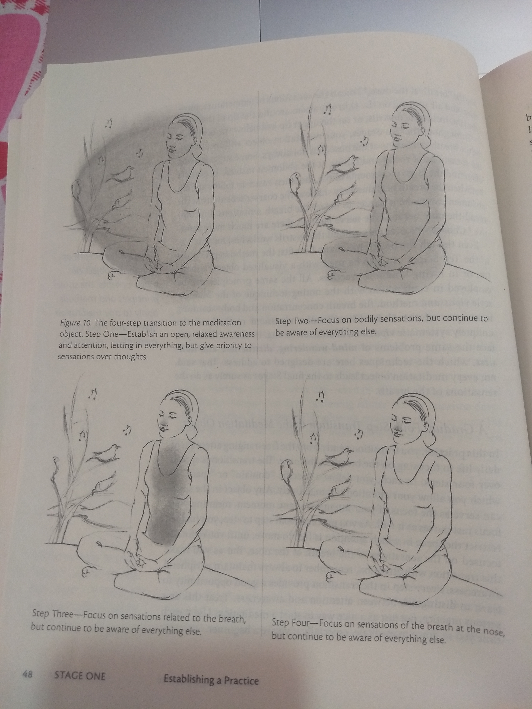

The Mind Illuminated
---

# Conscious experience and Objectives of Meditation
---

## Attention and awareness

Attention and awareness are two different ways of knowing the world. Attention singles out some small part of the field of conscious awareness to analyze and interpret it. Peripheral awareness provides the overall context for conscious experience.

## Jump starting the practice.

---

## Stable Attention : First Objective

Stable Attention is the ability to intentionally direct and sustain the focus of attention, as well as to control the scope of attention.

**Spontaneous movements of attention** - The opposite of stable attention is Spontaneous movements of attention. Attention moves spontaneously in three different ways: scanning, getting captured, and alternating.

**Sustaining Attention** - Now, sustaining attention is trickier than directing attention. Why? it's possible to voluntarily direct attention. However, the part of the mind that sustains attention for more than a few moments works entirely unconsciously. We can't use our will to control how long we remain focused on one thing. Instead, an unconscious process weighs the importance of what we are focusing on against other possible objects of attention. If an object is important or interesting , attention remains stable. if something else is judged more important or interesting, then the balance tips, and attention moves elsewhere.

Scope of attention - Once you can direct and sustain your attention, you will then work on controlling the scope of attention: how wide or narrow you want your focus to be.

## Mindfulness : Second Objective

Mindfulness allows us to recognize options, choose responses, and take control of our lives. It gives us the power to become the person we want to be. It also leads to Insight, Wisdom and Awakening. It is the optimal interaction between attention and Peripheral awareness, which requires increasing the overall conscious power of the mind.

Attention analyzes out experience, and Peripheral awareness provides the context. When one or the other doesn't do its job, or when there isn't enough interaction between the two, then we respond to situations less effectively. We may overreact, make poor decisions, or misinterpret what's going on.

**Peripheral Awareness Vs Attention**

**Cultivating Mindfulness**

Consciousness is a limited power source. Both attention and awareness draw their energy from this shared source. There will be always trade-off between the two. When attention focuses intensely on an object, the field of conscious awareness begins to contract, and peripheral awareness of the background fades. This is always a problem in situations where *attention drains our conscious capacity, such as during an argument, dealing with an urgent problem, or when falling in love*.

**Increasing the power of Mindfulness**

The goal is to increase the total power of Consciousness available for both attention and awareness. Like strengthening a muscle, developing powerful Mindfulness involves enhancing a natural capacity we all have. With Mindfulness, life becomes richer and more satisfying. You don't take things personally. Attention plays an appropriate role within the context of a broad and powerful awareness.

---

# Stage One - Establishing a Practice

## How to begin your Practice

Direct your attention toward a well-defined Meditation object. Whenever your attentions slips, redirect it back to that object. Repeat this as often as needed.

**Six-Point Preparation for Meditation**

1. Fire up your motivation - Having a clear sense of purpose will fire up your motivation and help you deal with any feelings of restlessness or resistance.

2. Set Reasonable goals - Ask yourself what you hope to accomplish in this particular session.

3. Beware of expectations - Resolve to hold the goals you have set very lightly, to find enjoyment in every Meditation no matter what happens, and to savor any achievement. Don't get frustrated or agitated when you are not able to achieve the goals. Be patient. It will happen. And always remember, there is not such thing as a "bad Meditation".

4. Commit to Diligence - Diligence means engaging wholeheartedly in the practice rather than spending your time on the cushion planning or daydreaming. You will be tempted to think about things that are more interesting or "important" than the meditation object - problems to be solved, projects to plan, and fantasies to entertain. So commit not to indulge in these tempting distractions.

5. Review Potential Distractions - Check to see if your mind is occupied by any worries about the future, regrets about the past, doubts, or other annoyances. Acknowledge these thoughts and emotions, whatever they are, and resolve to set them aside if they arise. You may not be wholly successful, but just setting the intention will make them easier to handle.

6. Adjust your posture - Review your posture and get comfortable:

---

## Preparation for Meditation

---

# The Meditation Object

A meditation object is something you intentionally choose to be the focus of your attention during meditation. The breath is ideal for Cultivating attention and Mindfulness. You can meditate on the breath at any opportunity, wherever you are, every day - even up to your dying breath. The breath also changes over time, becoming fainter as concentration deepens. This makes it suitable for developing powerful attention, since the details you focus on become ever more subtle as sensation grow less distinct.

Likewise, the fact that sensations change continuously, moment by moment, is conducive to Insight into the nature of impermanence. Yet, the breath also constantly repeats itself, over and over in the same pattern, making it suitable as a fixed meditation object for entering status of meditative absorption.

When we refer to the "breath" as the meditation object, we mean the sensations produced by breathing.

---

## A Gradual Four-Step Transition to the Meditation Object

**STEP ONE: FOCUS ON THE PRESENT**

Remain in the present, here and now.

Mindfully observing thoughts is tricky, so it's better to focus on sounds , smells, and physical sensations to avoid being hooked by thoughts. A helpful phrase to remember when dealing with distractions of any kind is, **let it come. let it be. let it go**. Don't try to suppress it, just let it come into peripheral awareness. Don't engage the distraction or focus attention on it, simply disregard it and let it be in the background. Then, let it go away by itself.

**STEP TWO: FOCUS ON BODILY sensations**

With your attention limited to bodily sensations, let everything else slip onto the background of peripheral awareness. Nothing should be suppressed or excluded from your field of conscious awareness. Just let sounds, smells, and thoughts keep circulating in the background, but don't focus on them. Let them come. Let them be and let them go in peripheral awareness while you restrict  all movements of attention to bodily sensations. Whenever you notice your attention going to sound or thought, bring it back to the body.

**STEP THREE: FOCUS ON BODILY SENSATIONS RELATED TO THE BREATH**

Start paying attention to all the different kinds if breath-related sensations. You will notice them especially around your nose, face , chest and abdomen. You may find sensations of movement caused by the breath in your upper arms and shoulder, or elsewhere. Take your time to become familiar with all these breath-related  sensations. In particular, savor any pleasant qualities associated with them. You may notice the mind becomes mildly invigorated during the in-breath, while the our=breath feels more relaxing and soothing.

Without suppressing anything else in your field of conscious awareness, restrict your attention to these breath-related sensations. Once you settle in, start focusing more directly on the sensations of the breath in specific areas. Closely observe the rise and fall of the abdomen, then the expansion and contraction of the chest, then the sensations produced by air moving in and out of the nostrils. Allow your mind to move freely among the abdomen, chest, nose and anywhere else where you fell breath-related sensations.

**STEP FOUR: FOCUS ON SENSATION OF THE BREATH AT THE NOSE**

Direct your attention to the sensations produced by the air moving in and out of your nostrils. Locate where those sensations are clearest-just inside the nostrils, at the tip of the nose, on the upper lip, or wherever else. The area may be as small as a pencil eraser or up to two inches across. Also the location of sensations may not be quite the same for the in- and out-breaths.

Keep your attention on the area where the breath sensations are clearest. Don't try to follow the air as it moves into the body or out your nose. Just observe the sensations from the air passing over the spot where you're focusing your attention. Remember, the meditation object is the sensations of the breath, not the breath itself.

---

## Counting as a method to Stabilize Attention

Once you have moved through the four steps and attention is restricted to the breath at the nose, start silently counting each breath. Your goal will be to follow the sensations continuously for ten consecutive breaths. When your attention slips or you lose track of the count, which will happen frequently at first, just start over again at one.

Finally, you are not trying for nonverbal or non-conceptual observation at this point. You can talk to yourself and think about the breath as much as you like while observing it, as long as you don't completely lose awareness of the actual sensations, or lose track of the count.
